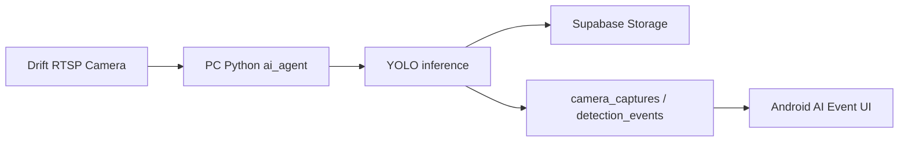
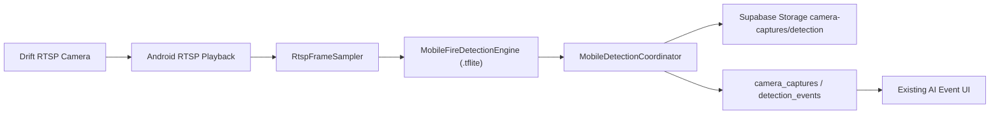

# Mobile RTSP Fire Detection Design

Date: 2026-06-04
Status: Approved for planning

## Goal

Build a first on-device AI proof of concept where the Android app receives a Drift RTSP stream and runs fire detection locally on the smartphone, without requiring the current PC Python YOLO worker for this specific fire detection path.

The first scope is intentionally narrow:

- Target only fire detection.
- Run only while the RTSP real-time/detail screen is open.
- Keep the PC `ai_agent` path available as the stable fallback.
- Reuse the existing Supabase event and capture contracts so the current AI event UI continues to work.

## Current Context

Today, the production-like AI flow is:

The Android app already has RTSP playback dependencies through Media3/ExoPlayer and LibVLC-related work. The Python worker handles frame capture, YOLO inference, cooldown, image upload, and event creation. The mobile PoC moves only the fire branch of that work into Android.

## Proposed Architecture

## Components

### MobileFireDetectionEngine

Responsibilities:

- Load the converted fire model from Android assets.
- Resize and normalize sampled frames to the model input size.
- Run TensorFlow Lite inference.
- Decode model output into boxes, labels, and confidence scores.
- Apply confidence filtering and non-max suppression.

Initial runtime:

- TensorFlow Lite CPU/XNNPACK first.
- GPU delegate remains optional after the CPU path is correct.

Reasoning:

TensorFlow Lite is a natural Android deployment target for mobile inference. Android's NNAPI path is deprecated in Android 15, so the design should not depend on NNAPI as the primary long-term acceleration path. GPU delegate can be evaluated later for performance.

### RtspFrameSampler

Responsibilities:

- Attach to the RTSP playback/detail screen.
- Sample one frame every 1-2 seconds, not every rendered frame.
- Provide a bitmap or pixel buffer to the detection engine.
- Stop immediately when the screen leaves composition or playback stops.

Initial behavior:

- Sampling interval defaults to 2 seconds for thermal and battery safety.
- The interval can be lowered to 1 second during manual testing.

### MobileDetectionCoordinator

Responsibilities:

- Own the screen-level state machine:
  - off
  - warming up
  - running
  - detected
  - cooldown
  - error
- Connect sampling, inference, cooldown, and upload.
- Prevent duplicated events using a `(camera_id, "fire")` cooldown key.
- Surface compact UI state to the RTSP card/detail screen.

Initial cooldown:

- 60 seconds per camera for fire.
- Cooldown is local to the screen process in the first PoC.

### DetectionUploadRepository

Responsibilities:

- Upload the detected frame to Supabase Storage.
- Use the existing capture path convention:
  - `camera-captures/detection/{cameraId}/fire_{cameraId}_{timestamp}.jpg`
- Register the capture row.
- Register or call the existing event creation path so `detection_events` and the current AI Event UI receive the result.

The upload contract should match the PC `ai_agent` output as closely as possible. The AI Event detail screen should not need a new data model for this PoC.

The mobile endpoint must fail closed unless the request includes an authenticated user bearer token. The token subject must resolve to the same `profiles` row as the body `user_id`, and the profile's registered FCM token and camera group must match before any image decode, Storage upload, or event creation happens.

## UI Placement

The PoC belongs in the real-time RTSP card/detail flow.

Initial UI:

- A small status badge near the RTSP live panel.
- Labels:
  - `모바일 감지 꺼짐`
  - `모바일 감지 준비 중`
  - `모바일 감지 실행 중`
  - `화재 감지`
  - `모바일 감지 대기`
  - `감지 오류`
- Optional compact diagnostics for development builds:
  - last inference milliseconds
  - last sampled time
  - last confidence

The UI should not introduce a separate lab screen for the first build. This keeps the PoC close to the actual operator workflow.

## Data Flow

1. Manager opens a real-time RTSP camera detail screen.
2. App starts RTSP playback.
3. `RtspFrameSampler` samples a frame every 1-2 seconds.
4. `MobileFireDetectionEngine` runs inference.
5. If no fire passes the threshold, the UI remains `모바일 감지 실행 중`.
6. If fire passes threshold and cooldown is open:
   - save the sampled frame as JPEG,
   - upload it to Supabase Storage,
   - create/register the capture,
   - create/register the detection event,
   - update UI to `화재 감지`,
   - enter cooldown.
7. Existing AI Event UI displays the new event using the stored capture image.

## Error Handling

- RTSP playback unavailable:
  - keep the existing playback error UI,
  - show `감지 오류`,
  - do not attempt inference.
- Model missing or load failure:
  - disable mobile detection for that session,
  - show a concise error state,
  - avoid app crash.
- Inference failure:
  - skip that sample,
  - keep playback alive,
  - log the exception.
- Upload failure:
  - keep local detection result visible briefly,
  - show upload failure in diagnostics,
  - do not create a partial event without a valid capture URL.
- Repeated detection:
  - enforce local cooldown before upload/event creation.

## Non-Goals

- No background detection in the first PoC.
- No five-detector mobile migration in the first PoC.
- No fall detection migration in the first PoC.
- No replacement of the PC `ai_agent` yet.
- No broad UI redesign.

## Success Criteria

- Drift RTSP video is visible in the real-time/detail screen.
- The app samples frames from that screen without crashing.
- A converted fire model runs on Android.
- A real detection frame is uploaded to Supabase Storage under the existing detection path convention.
- A corresponding AI event appears in the existing AI Event UI.
- The app can run the flow for 3-5 minutes without crashing or creating repeated duplicate events.
- If model/runtime initialization fails, the app surfaces an error state instead of closing.

## Verification Plan

- Unit tests:
  - engine output parsing and NMS with fixed tensors,
  - cooldown reducer/state transition behavior,
  - upload path generation contract.
- Manual Android test:
  - open RTSP detail screen,
  - enable mobile fire detection,
  - present a fire test scene or approved fire reference target,
  - verify Supabase Storage image and `detection_events` row,
  - verify AI Event UI uses the actual uploaded capture.
- Performance smoke test:
  - record inference time,
  - run 3-5 minutes,
  - observe app stability, battery drain, and device heat.

## Implementation Plan

Implementation is tracked in `docs/superpowers/plans/2026-06-04-mobile-rtsp-fire-detection.md`.
Operational verification steps are tracked in `docs/mobile-rtsp-fire-detection-runbook.md`.

## References

- Android Neural Networks API: https://developer.android.com/ndk/guides/neuralnetworks/
- TensorFlow Lite GPU delegate: https://android.googlesource.com/platform/external/tensorflow/+/refs/heads/main/tensorflow/lite/g3doc/performance/gpu.md
- ONNX Runtime Mobile: https://onnxruntime.ai/docs/get-started/with-mobile.html
- Ultralytics TFLite export guide: https://docs.ultralytics.com/integrations/tflite/
